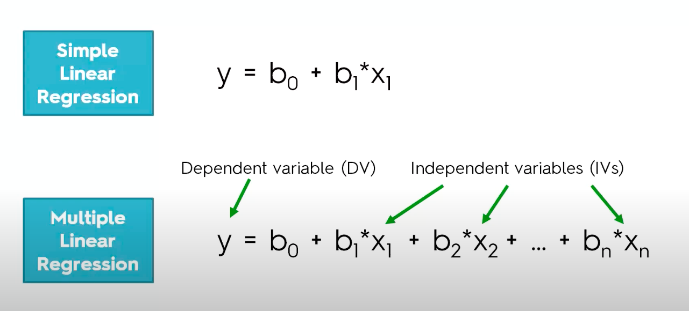

# Solve Multiple Linear Regression in R
> This program preprocesses the data and applies Multiple linear regression.

 
5 methods of building models to solve Multiple Linear Regression:
 
1. All-in
 
2. Backward Elimination
 
3. Forward Selection
 
4. Bidirectional Elimination
 
5. Score Comparison
 
 
library automatically chooses the optimal model and gives the result.
 
For automatically chosen optimal model run MultipleLinearRegression.R
 
If you want to use the Backward Elimination model, run BackwardElimination.R
 
 
If you like my work, you can contribute to https://www.patreon.com/xscotophilic 
Thank You!