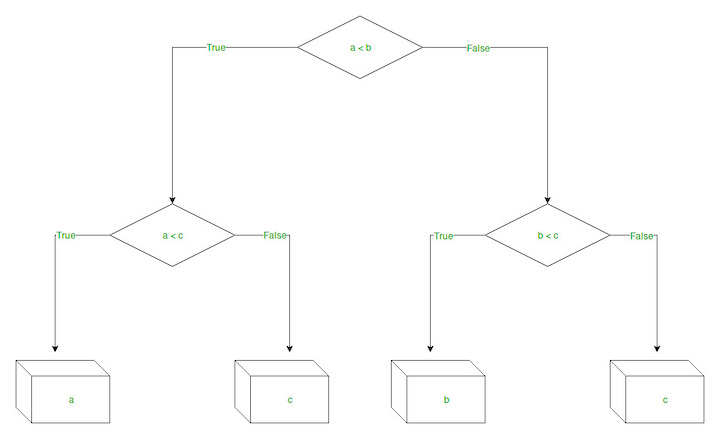

# Solve Decision Tree Regression in python
> This program preprocesses the data and applies Decision Tree Regression. Decision Tree Regression is used when we are trying to predict an output variable that is continuous.

#### In a regression tree, a regression model is fit to the target variable using each of the independent variables. The data is then split at several points for each independent variable.
#### At those points, the error between the predicted values and actual values is squared to get “A Sum of Squared Errors”(SSE). The point that has lowest SSE is chosen as the split point. This process is continued recursively.

 
If you like my work, you can contribute to https://www.patreon.com/xscotophilic 
Thank You!