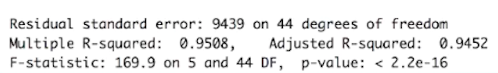

# Evaluating Regression Models Performance and Model Selection

### A) Evaluate Regression Models Performance

#### Some of the techniques to Evaluate Regression Models Performance

* Mean Absolute Error (MAE)

* Root Mean Square Error (RMSE)

* R Squared

* Adjusted R Squared

##### You can read about it in details on : [Link one](https://openclassrooms.com/en/courses/6401081-improve-the-performance-of-a-machine-learning-model/6519016-evaluate-the-performance-of-a-regression-model) [Link two](https://analyticsindiamag.com/r-squared-vs-adjusted-r-squared/)

---
### B) Model Selection

#### 1. Model Selection in Python

* Here you can use code templates of different regression models provided in the "Model Selection in python" folder. To use these templates, the dependent variable has to be in the last column. Each model will give R Squared value and by using that you can evaluate your model. The greater the R Squared value better the model is.

* You can use python (anaconda spyder recommended) to run .py scripts.

* You can use Google Colab or Jupyter Notebook to run .ipynb scripts.

#### 2. Model Selection in R Language

* Here you can use my GitHub repositories of different regression models in R. To use these R scripts, You have to make some changes based on the ENTER_THE_NAME_OF_YOUR_DATASET_HERE.csv file you provide. Each model will give R Squared value and by using that you can evaluate your model. The greater the R Squared value better the model is.

* You can see the summary by using regressor.sumarry() method in each R script. (Example shown below.)

* You can use Rstudio to run .R scripts.

---

### If you like my work, you can contribute to https://www.patreon.com/xscotophilic

### Thank You!