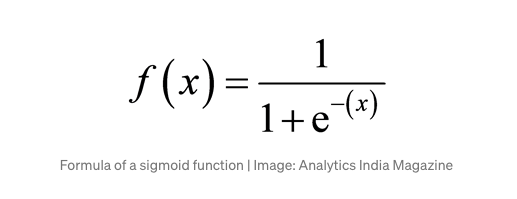
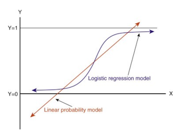

# Solve Logistic Regression Classification in R Language
> This program preprocesses the data and applies Logistic Regression.

* Logistic regression is an algorithm for classification used to assign a discrete set of classes to observations. Email spam or not spam, fraud or not fraud are some of the examples of classification problems.

* Logistic Regression is a machine learning algorithm, a predictive analysis algorithm focused on the idea of probability, which is used for classification problems.

* We use the Sigmoid function to map expected values to probabilities. The function maps every real value between 0 and 1.

* How linear regression works vs How logistic regression works:

* Linear regression is used to predict the continuous dependent variable using a given set of independent variables. 

* Logistic Regression is used to predict the categorical dependent variable using a given set of independent variables.

* You can read about it in details on provided link: [Click here](https://www.javatpoint.com/linear-regression-vs-logistic-regression-in-machine-learning#:~:text=Linear%20regression%20is%20used%20to,given%20set%20of%20independent%20variables.&text=Logistic%20regression%20is%20used%20for%20solving%20Classification%20problems.)

---

## To install package ElemStatLearn:

1. Download the package from [this link](https://cran.r-project.org/src/contrib/Archive/ElemStatLearn/).

2. You can then go to R-Studio. Please proceed to the tools menu and click install packages.

3. Under 'Install from:' choose package install file(.zip; .tar,etc)

4. Choose the downloaded package

---

### If you like my work, you can contribute to https://www.patreon.com/xscotophilic

### Thank You!