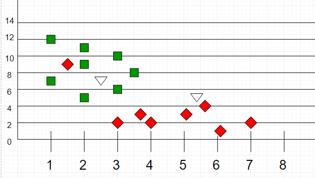

# Solve K Nearest Neighbor (KNN) Classification in R Language
> This program preprocesses the data and applies K Nearest Neighbor (KNN) Classification.

*  K Nearest Neighbor (KNN) Classification is an algorithm for classification used to assign a discrete set of classes to observations. Email spam or not spam, fraud or not fraud are some of the examples of classification problems.

* The KNN algorithm assumes that similar things exist in close proximity. In other words, similar things are near to each other.

* This means a point close to a cluster of points classified as ‘Red’ has a higher probability of getting classified as ‘Red’.

Algo:

1. Select the K.
2. Calculate the Euclidean distance of n number of neighbours from unclassified sample.
3. Take the K nearest neighbors as per the calculated Euclidean distance.
4. Count the number of the data points in each category (as an example, K = 5, and 3 red datapoints and 2 green datapoints are closer to unclassified sample then that sample will belong to red class).
5. Assign the new data points to that category for which the number of the neighbor is maximum.

* You can read more about it in details on provided links: [Click here](https://www.geeksforgeeks.org/k-nearest-neighbours/) | [Or here](https://www.javatpoint.com/k-nearest-neighbor-algorithm-for-machine-learning) | [Or here](https://towardsdatascience.com/machine-learning-basics-with-the-k-nearest-neighbors-algorithm-6a6e71d01761)

---

## To install package ElemStatLearn:

1. Download the package from [this link](https://cran.r-project.org/src/contrib/Archive/ElemStatLearn/).

2. You can then go to R-Studio. Please proceed to the tools menu and click install packages.

3. Under 'Install from:' choose package install file(.zip; .tar,etc)

4. Choose the downloaded package

---
### If you like my work, you can contribute to https://www.patreon.com/xscotophilic

### Thank You!