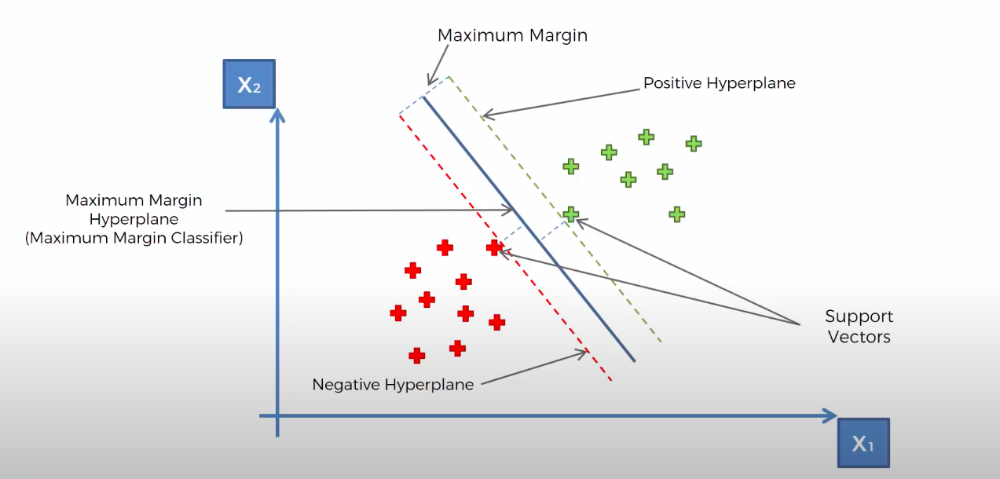

# Solve Support Vector Machine (SVM) Classification in R Language
> This program preprocesses the data and applies SVM Classification.

*  The goal of the support vector machine algorithm is to find a hyperplane in an N-dimensional space that distinctly classifies the data points. Email spam or not spam, fraud or not fraud are some of the examples of classification problems.

* To differentiate the two groups of data points, there are several potential hyperplanes that could be selected. And we have to find a plane that has the maximum distance between data points of both classes. As shown in example.

* Hyperplanes are judgement boundaries that help define the data points. Data points falling on either side of the hyperplane may be assigned to various groups.

* You can read more about it in details on provided links: [Click here](https://towardsdatascience.com/support-vector-machine-introduction-to-machine-learning-algorithms-934a444fca47) | [Or here](https://www.tutorialspoint.com/machine_learning_with_python/machine_learning_with_python_classification_algorithms_support_vector_machine.htm) | [Or here](https://www.javatpoint.com/machine-learning-support-vector-machine-algorithm)

---

## To install package ElemStatLearn:

1. Download the package from [this link](https://cran.r-project.org/src/contrib/Archive/ElemStatLearn/).

2. You can then go to R-Studio. Please proceed to the tools menu and click install packages.

3. Under 'Install from:' choose package install file(.zip; .tar,etc)

4. Choose the downloaded package

---

### If you like my work, you can contribute to https://www.patreon.com/xscotophilic

### Thank You!