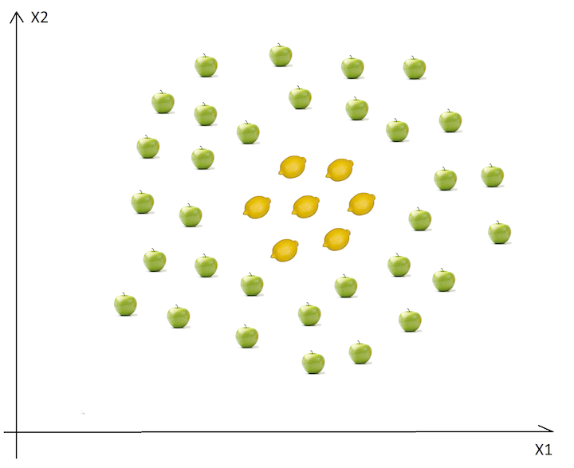
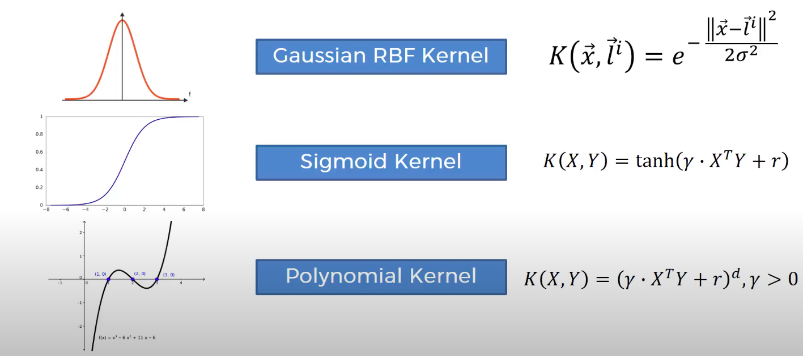

# Solve Kernel Support Vector Machine (SVM) Classification in R Language
> This program preprocesses the data and applies Kernel SVM Classification.

*  If you haven't read about Support Vector Machine, visit this link: [SVM GitHub](https://github.com/tyrion404/ML-Support-Vector-Machine-SVM-Classification-in-R)

* We can not find a straight line in this scenario to separate apples from lemons.

* The basic aspect is that if a data set in the current dimensions is inseparable, add another dimension, maybe the data will be separable in that way.

* Mapping to Higher Dimensions: 

We should not just blindly incorporate another dimension to solve this problem, we should transform the space such that we actively create this degree differential. Refer Mapping from 1D to 2D example on [SVM and Kernel SVM towardsdatascience.com](https://towardsdatascience.com/svm-and-kernel-svm-fed02bef1200)

* Kernel Types

* You can read more about Kernel Support Vector Machine in details on provided links: [SVM and Kernel SVM towardsdatascience.com](https://towardsdatascience.com/svm-and-kernel-svm-fed02bef1200) | [SUPPORT VECTOR MACHINES(SVM) towardsdatascience.com](https://towardsdatascience.com/support-vector-machines-svm-c9ef22815589) | [Major Kernel Functions in Support Vector Machine (Python)](https://www.geeksforgeeks.org/major-kernel-functions-in-support-vector-machine-svm/) | [Sklearn documentation](https://scikit-learn.org/stable/modules/generated/sklearn.svm.SVC.html)

---

## To install package ElemStatLearn:

1. Download the package from [this link](https://cran.r-project.org/src/contrib/Archive/ElemStatLearn/).

2. You can then go to R-Studio. Please proceed to the tools menu and click install packages.

3. Under 'Install from:' choose package install file(.zip; .tar,etc)

4. Choose the downloaded package

---

### If you like my work, you can contribute to https://www.patreon.com/xscotophilic

### Thank You!