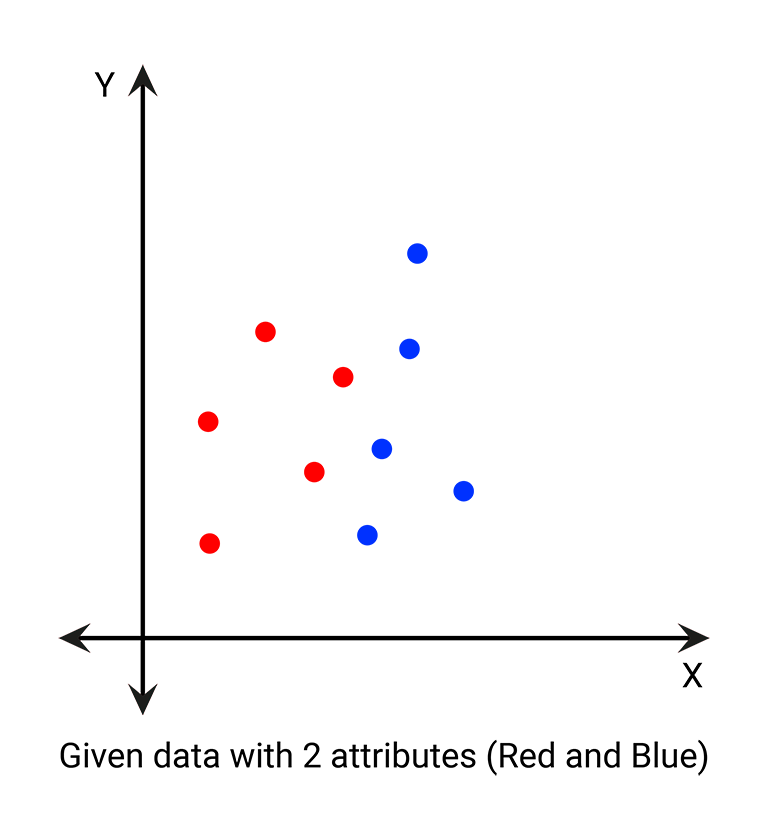
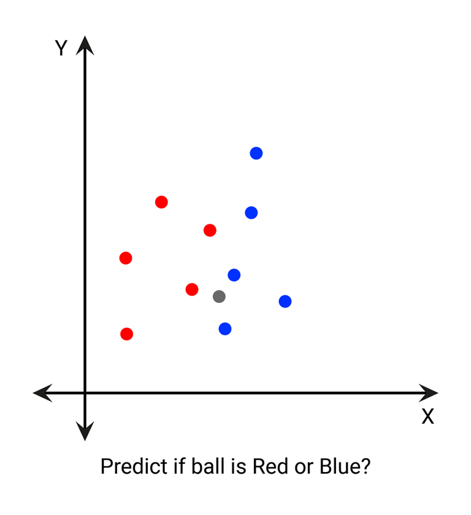
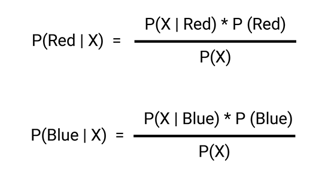
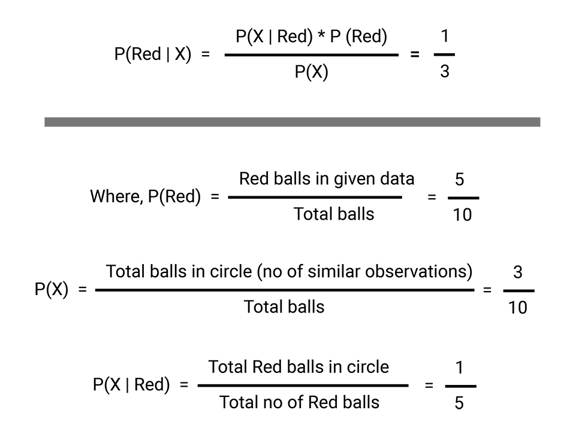

# Naive Bayes Classification in R Language

* We have data as shown in below picture.

* Now we want to predict if the ball(X) is red or blue.
1) Define redius r. 
2) Draw a circle with redius r and center as (a,b).

* calculate P(Red | X) (for details follow given links). Basically, we are trying to find probability of event Red, given the event X is true.
* calculate P(Blue | X) (for details follow given links). Basically, we are trying to find probability of event Blue, given the event X is true.

* where P(Red) is the prior probability of class. 
* P(x) is the prior probability of predictor or Marginal Likelihood. 
* P(x | Red) is the likelihood - which is the probability of predictor given class.
* P(c|x) is the posterior probability of class (target) given predictor (attribute).

* We get P(Red | X) = 0.333 and P(Blue | X) = 0.666. P(Red | X) < P(Blue | X) thus possibility of X being blue is more.

### You can read about Naive Bayes Classification in details on provided links: 

* [All about Naive Bayes - on towardsdatascience.com](https://towardsdatascience.com/all-about-naive-bayes-8e13cef044cf)

* [An Introduction to the Naive-Bayes Algorithm - on towardsdatascience.com](https://towardsdatascience.com/an-introduction-to-the-naive-bayes-algorithm-be3bd692273e)

* [How I was using Naive Bayes (Incorrectly) till now - on towardsdatascience.com](https://towardsdatascience.com/how-i-was-using-naive-bayes-incorrectly-till-now-part-2-d31feff72483)

* [Naive Bayes Classifiers - on geeksforgeeks](https://www.geeksforgeeks.org/naive-bayes-classifiers/)

---

### If you like my work, you can contribute to https://www.patreon.com/xscotophilic

### Thank You!