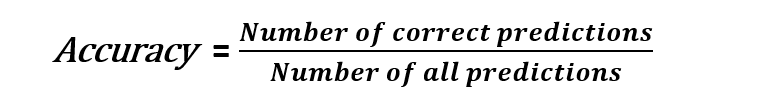
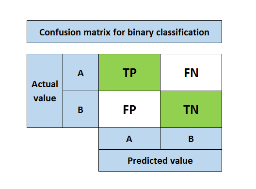
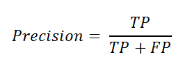
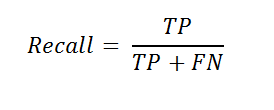
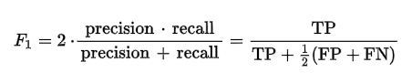
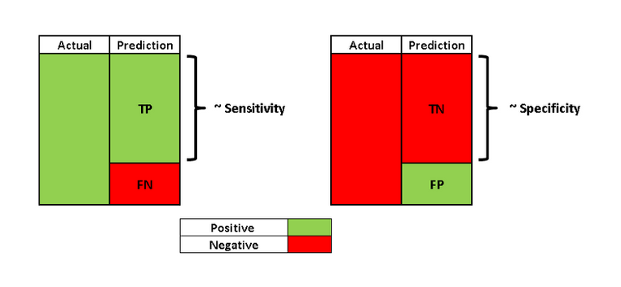

# Evaluate a Classification Model using any of the given method

1. Classification accuracy

* The accuracy of classification indicates how many of the predictions were accurate (True predictions / Total predictions).

---

2. Confusion matrix

* True positive (TP): Predicting positive class as positive (ok)
* False positive (FP): Predicting negative class as positive (not ok)
* False negative (FN): Predicting positive class as negative (not ok)
* True negative (TN): Predicting negative class as negative (ok)
* The desired outcome is that the prediction and actual class are the same.

---

3. Precision and recall

* Precision and recall metrics go beyond classification precision and include a more comprehensive view of model evaluation.

* The focus of precision is positive predictions. It indicates how many positive predictions are true.

* The focus of recall is actual positive classes. It indicates how many of the positive classes the model is able to predict correctly.

---

4. F1 score

* F1 score is the weighted average of precision and recall.

---

5. Sensitivity and specificity

* Sensitivity, also known as the true positive rate (TPR), is the same as recall.

* Specificity is similar to sensitivity but focused on negative class.

---

6. ROC curve and AUC

* ROC (receiver operating characteristics) curve and AOC (area under the curve) measures are best explained with a logistic regression example. Refer the given [Link](https://towardsdatascience.com/how-to-best-evaluate-a-classification-model-2edb12bcc587).

### You can read about Classification in details from: 

* Machine Learning, Tom Mitchell, McGraw Hill (Book)

---

### If you like my work, you can contribute to https://www.patreon.com/xscotophilic

### Thank You!