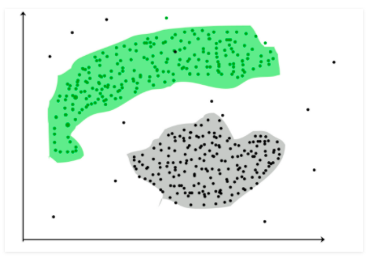

# Clustering

* Clustering is the process of categorizing data points into groups, data points in the same group are more similar to other data points in same groups than data points in other groups.

* For example refer below image: 

* There are two well known clustering methods:
1. K-Means Clustering and
2. Hierarchical Clustering

### You can read about Clustering in details on provided links: 

* [Clustering in Machine Learning - on geeksforgeeks](https://www.geeksforgeeks.org/clustering-in-machine-learning/)

---

### If you like my work, you can contribute to https://www.patreon.com/xscotophilic

### Thank You!