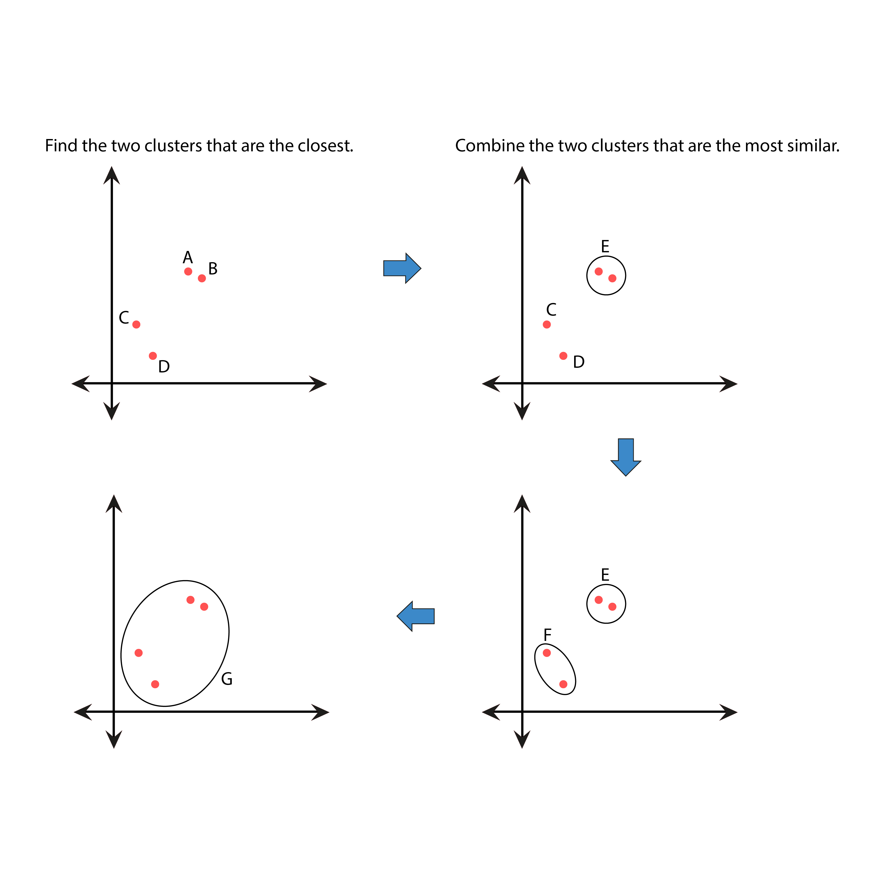
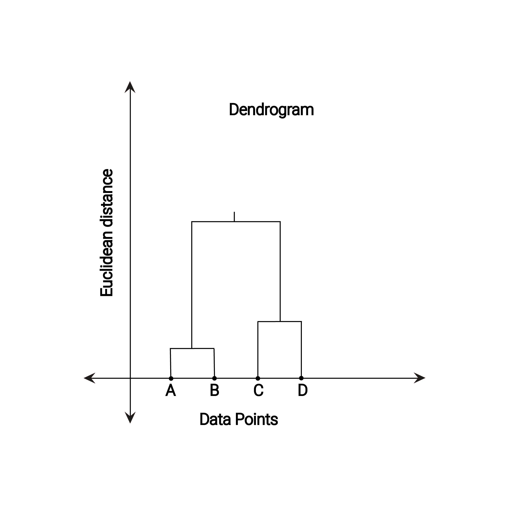

# Hierarchical Clustering

* Hierarchical clustering, is an algorithm that groups similar objects into groups called clusters.

* At starting each observation is viewed as a separate cluster. Then it performs the following two steps repeatedly: 
1. find the two clusters that are the closest.
2. combine the two clusters that are the most similar.

* The distance between two clusters has been computed based on the length of the straight line drawn from one cluster to another.

* The basic method to generate hierarchical clustering are:
1. Agglomerative (We will focus on this one) and
2. Divisive

### You can read about K-Means Clustering in details on provided links: 

* [What is Hierarchical Clustering - on Displayr](https://www.displayr.com/what-is-hierarchical-clustering/#:~:text=Hierarchical%20clustering%2C%20also%20known%20as,broadly%20similar%20to%20each%20other.)

* [Hierarchical Clustering in Data Mining - on geeksforgeeks](https://www.geeksforgeeks.org/hierarchical-clustering-in-data-mining/)

---

### If you like my work, you can contribute to https://www.patreon.com/xscotophilic

### Thank You!