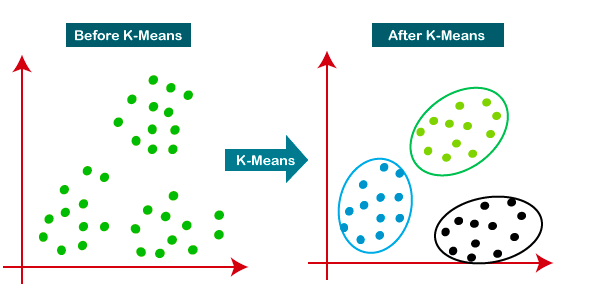
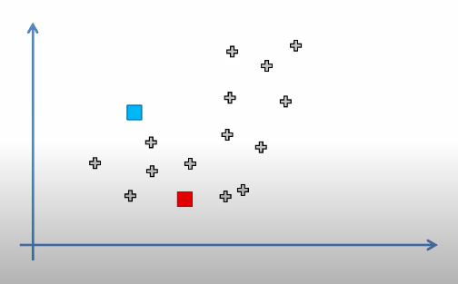
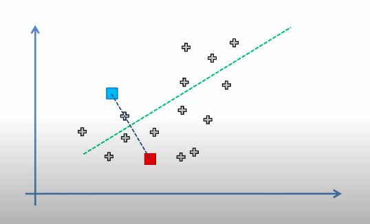
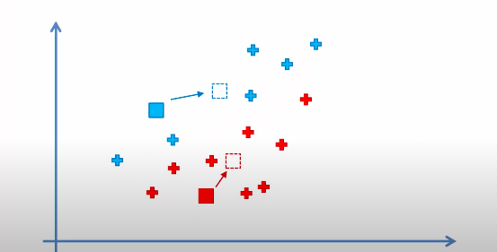
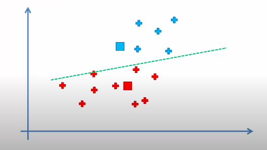

# K-Means Clustering

* K-Means Clustering is an Unsupervised Learning algorithm, which groups the unlabeled dataset into different clusters.

* K denotes the number of pre-defined clusters that will be generated during the process; for example, if K=2, there will be two clusters.

* Algorithm:
1. Select the k values, called centroids or means. (eg. K = 2)
2. Initialize the centroids. (Check the figure below)

3. We categorize each item to its closest centroid(mean). (Check the figure below)

4. Compute and place the new centroid of each cluster. (Centroid will take place in center of categorized cluster data.) (Check the figure below)

5. Reassign each data point to the new closest centroid. If any reassignment took place, go to STEP 4. otherwise exit. (Check the figure below)

* When to stop?
1. If there is no change in centroids values because the clustering has been successful.
2. The defined number of iterations has been achieved.

### You can read about K-Means Clustering in details on provided links: 

* [Understanding K-means Clustering in Machine Learning - on towardsdatascience.com](https://towardsdatascience.com/understanding-k-means-clustering-in-machine-learning-6a6e67336aa1)

* [K means Clustering – Introduction - on geeksforgeeks](https://www.geeksforgeeks.org/k-means-clustering-introduction/)

---

### If you like my work, you can contribute to https://www.patreon.com/xscotophilic

### Thank You!