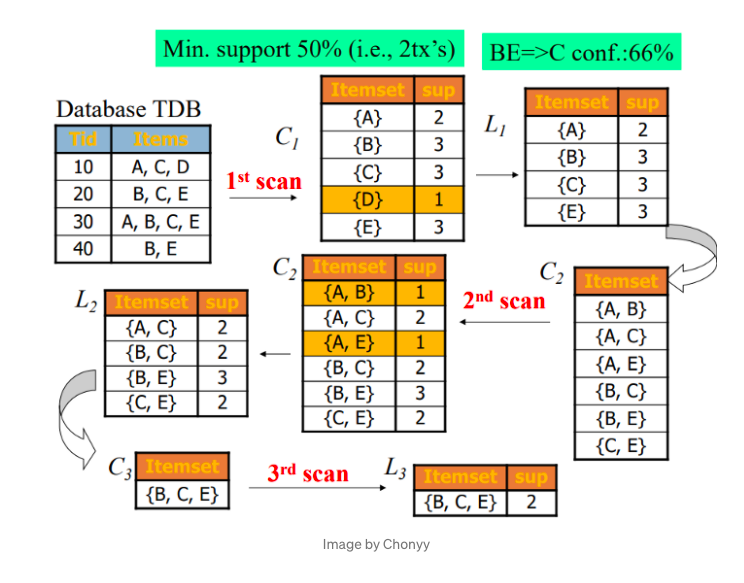

# Apriori Algorithm

### Apriori Property -> All non-empty subset of frequent itemset must be frequent.

- Apriori Algorithm
1. Set a minimum support and confidence
2. Take all the subsets in transactions having higher support than minimum support
3. Take all the rules of these subsets having higher confidence than minimum confidence
4. Generate the candidate set by joining the frequent itemset from the previous stage.
5. Perform subset testing and prune the candidate set if there’s an infrequent itemset contained or does not satisfy minimum support.
6. Repeat step 4 and 5 for given iterations.

### You can read about Apriori Algorithm in details on provided links: 

- [Apriori: Association Rule Mining In-depth Explanation and Python Implementation (Ignore Implementation) - on towardsdatascience](https://towardsdatascience.com/apriori-association-rule-mining-explanation-and-python-implementation-290b42afdfc6)

- [Apriori Algorithm - on geeksforgeeks](https://www.geeksforgeeks.org/apriori-algorithm/)

---

### If you like my work, you can contribute to https://www.patreon.com/xscotophilic

### Thank You!