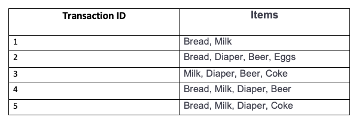

# Association Rule Mining/ Learning

### Association rule mining uncovers intriguing associations and relationships between large sets of data items.

- We can find rules that predict the occurrence of an object based on the occurrences of other items in the transaction given a collection of transactions.

- We can use Association Rules in any dataset where features take only two values i.e., 0 or 1.
  - eg. Market Basket Analysis
  - eg. People who buys X are likely to buy Y

- Measures of Effectiveness of the Rule
  - Support Count(sigma) = Frequency of occurrence of a itemset.
  - Confidence = An itemset whose support is greater than or equal to minsup threshold.
  - Lift is the ratio - Confidence is to Support

- Support means how much historical data supports your rule and Confidence means how confident are we that the rule holds.
  - For rule "A -> B" Support is the joint probability of A and B.
  - For rule "A -> B" Confidence is the conditional probability of B given A.

- If the lift is < 1 then A and B are negatively correlated else positively correlated and if it is equal to 1 it is not correlated.


- And by given data let’s assume we create association rule 
```
{Beer, Diaper} -> {Milk} 
```
- which means who buys milk and diaper he/she/they buys a beer. 
Support Count(sigma) = Frequency of occurrence of a itemset.
```
support for given rule: 2/5
confidence for given rule: 2/3
```
### You can read about Association Rule Mining/ Learning in details on provided links: 

* [Association Rule Mining - on towardsdatascience](https://towardsdatascience.com/association-rule-mining-be4122fc1793)

* [Association Rule - on geeksforgeeks](https://www.geeksforgeeks.org/association-rule/)
---

### If you like my work, you can contribute to https://www.patreon.com/xscotophilic

### Thank You!