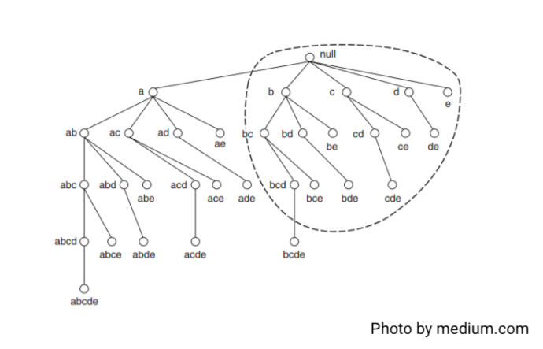

# ECLAT

### The ECLAT algorithm stands for Equivalence Class Clustering and bottom-up Lattice Traversal.

- ECLAT algorithm works in a vertical manner just like the Depth-First Search of a graph.
- The basic idea is to use Transaction Id Sets(tidsets) intersections to compute the support value of a candidate and avoiding the generation of subsets which do not exist in the prefix tree.

- Starting with node a, for example, the algorithm can count its support to see if it is frequent. If this is the case, the algorithm progresses to the next stage of nodes, such as ab, abc, and so on, until an infrequent node, such as abcd, is reached. It then returns to a previous branch, say abce, and resumes the quest from there.

### You can read about Apriori Algorithm in details on provided links: 

- [Association Rule Mining using ECLAT Algorithm - on medium](https://medium.com/machine-learning-and-artificial-intelligence/3-4-association-rule-mining-using-eclat-algorithm-b6e50aab2147)

- [ML | ECLAT Algorithm - on geeksforgeeks](https://www.geeksforgeeks.org/ml-eclat-algorithm/#:~:text=The%20ECLAT%20algorithm%20stands%20for,version%20of%20the%20Apriori%20algorithm.)

---

### If you like my work, you can contribute to https://www.patreon.com/xscotophilic

### Thank You!