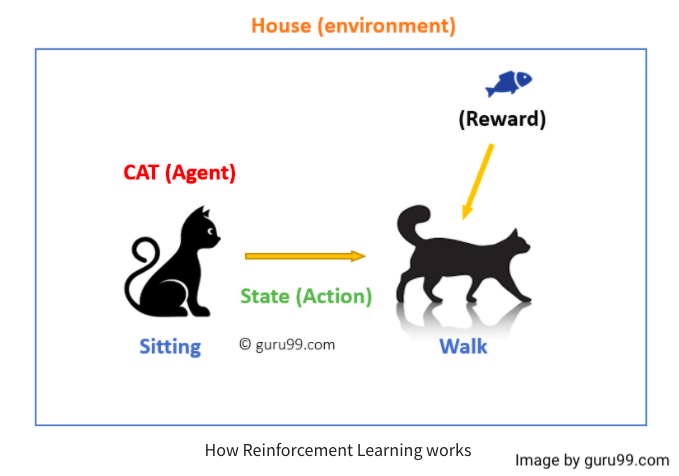

# Reinforcement learning

- Reinforcement learning is all about making decisions sequentially. In simple terms, the output is determined by the current input's state, and the next input is determined by the previous input's output.

- We have seen supervised learning before. In supervised learning, the initial input or the input given at the start is used to make a decision.

- Main points in Reinforcement learning
  - Input: The input should be an initial state from which the model will start
  -  Output: There are many possible output as there are variety of solution to a particular problem
  - Training: The training is based upon the input, The model will return a state and the user will decide to reward or punish the model based on its output.
  - The model keeps continues to learn.
  - The best solution is decided based on the maximum reward.

- As an Example:
  - 
  - Your cat is an agent that is in contact with the environment. It is your home in this case. A state could be that your cat is sitting and you use a specific word in for cat to walk.
  - Our agent responds by executing an action transition from one "state" to another.
  - For example, your cat may transition from sitting to walking.
  - An agent's reaction is an action, and policy is a method of selecting an action given a state in the hope of better outcomes.
  - They may receive a reward or a penalty as a result of the transition.
### You can read about Reinforcement learning in details on provided links: 

* [Reinforcement learning - on geeksforgeeks](https://www.geeksforgeeks.org/what-is-reinforcement-learning/)

---
### If you like my work, you can contribute to https://www.patreon.com/xscotophilic

### Thank You!