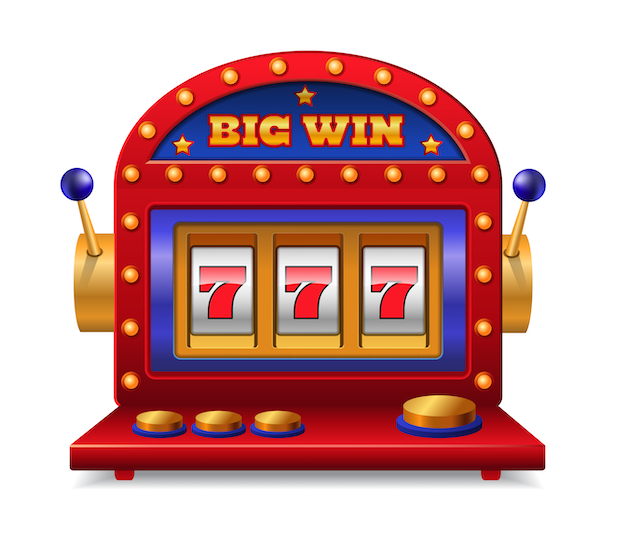
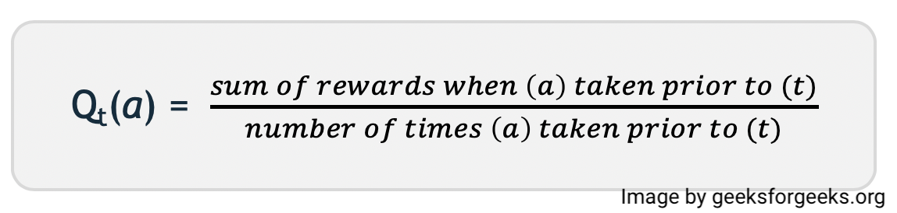
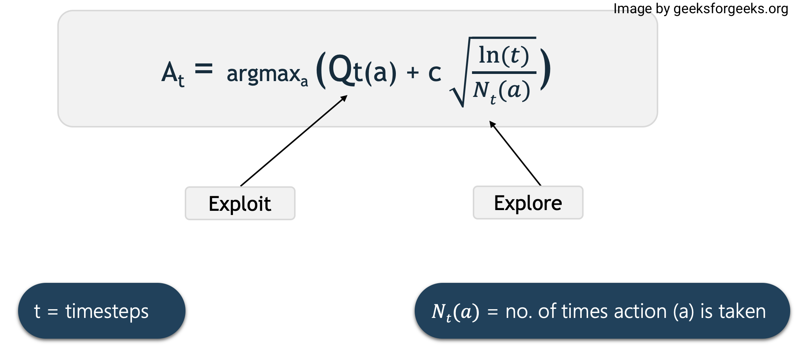

# Upper Confidence Bound (UCB)
### Multi-Armed Bandit Problem
  - 
  - The image above depicts a two-lever slot machine, also known as a bandit. We assume that each lever has its own reward distribution and that there is at least one lever that generates the highest reward.
  - The goal here is to figure out which lever to pull to get the highest reward after a set of trials.

- Exploration vs Exploitation:
  - Greedy Action: When an agent chooses the action with the highest estimated value at the time. By selecting the greedy action, the agent exploits its current knowledge.
  - Non-Greedy Action: When the agent does not choose the highest estimated value and foregoes immediate gratification in order to learn more about the other actions.
  - Exploration: It allows the agent to learn more about each action. Hopefully, this will result in long-term benefits.
  - Exploitation: It enables the agent to choose the greedy action in order to obtain the greatest reward for the shortest period of time. A greedy action selection can result in suboptimal behavior.

---

### Upper Confidence Bound (UCB)

- Upper Confidence Bound Algorithm tells which option to choose when multiple options are available.
- The Upper Confidence Bound follows the principle of optimism in the face of uncertainty which implies that if we are uncertain about an action, we should optimistically assume that it is the correct action.

- Action-value Estimate:
  - We'll use the sample-average method to estimate the value of selecting an action because the agent doesn't know what it's worth.
  - 

- Upper Confidence Bound Action Selection:
  - Upper-Confidence Bound action selection balances exploration and exploitation by using uncertainty in action-value estimates.
  - 

- How action is selected
  - For example, let’s say we have these four actions with associated uncertainties.
  - So according to the UCB algorithm, it will optimistically pick the action that has the highest upper bound i.e. A.
  - Assume that after performing action A, we find ourselves in a bad situation.
  - UCB will choose action B this time because Q(B) has the highest upper-confidence even though the confidence interval is small.
  - And algorithm stops when it finds a goal state.

### You can read about Upper Confidence Bound in details on provided links: 

* [Upper Confidence Bound Algorithm in Reinforcement Learning - on geeksforgeeks](https://www.geeksforgeeks.org/upper-confidence-bound-algorithm-in-reinforcement-learning/)

---

### If you like my work, you can contribute to https://www.patreon.com/xscotophilic

### Thank You!