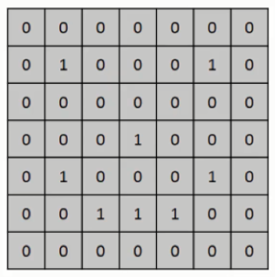
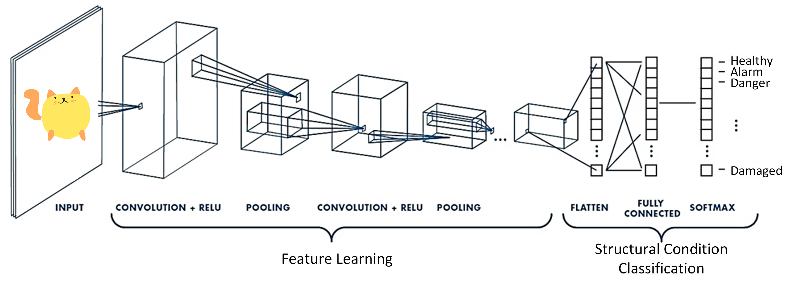
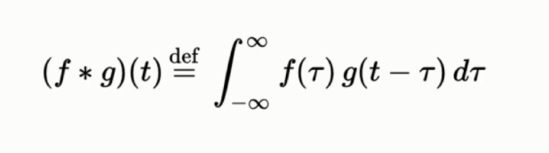
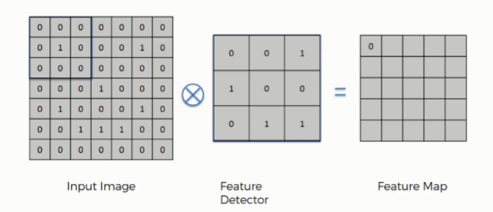
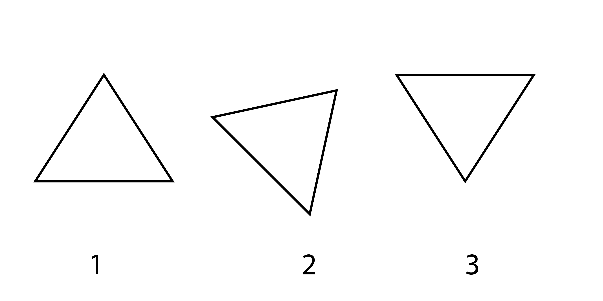
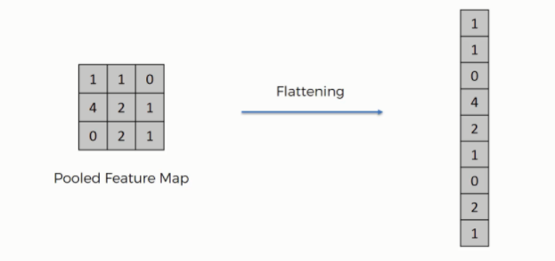
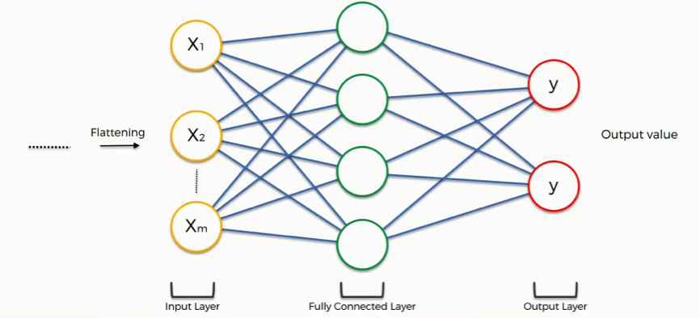
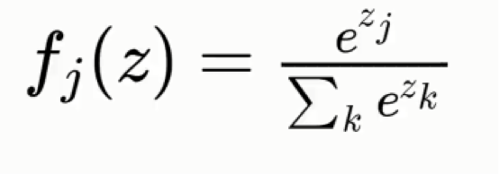

# Convolutional Neural Network (ConvNet/CNN)

> A Convolutional Neural Network (ConvNet/CNN) is a Deep Learning algorithm that can take an input image, assign importance (learnable weights and biases) to various aspects/ objects in the image, and distinguish between them.

- How do we identify objects and people in our environment or in images? Understanding this is a large part of understanding convolutional neural networks. In a nutshell, our brains depend on the detection of features to categorize the things we see.

---

- Preprocessing done before images go into CNN
- Scanning Images
  - Color images are scanned differently than black and white images.
  - Each pixel contains 8 bits (1 byte) of information.
  - Colors are represented on a scale from 0 to 255.
  - Computers just understand 1's and 0's. Thus the network does not actually learn colors.
  - Example of black and white image in bytes is shown below (consider black pixel as 1 and white as 0):
  - 

---

- Steps in Convolutional Neural Networks:
  1. (A) Convolution Operation
  1. (B) ReLU Layer
  2. Pooling
  3. Flattening
  4. Full Connection

---

## 1 (A). Convolution Operation

In purely mathematical terms, convolution is a function derived from two given functions by integration which expresses how the shape of one is modified by the other.

Image source superdatascience.com

- The Convolution Operation:

  - There are three components that go into the convolution process:
    - Input image
    - Feature detector
    - Feature map
  - For Black and white image it need 1 matrix to store data. We apply Feature detector to that 1 matrix.
  - 
    
    Image source superdatascience.com
  - For RGB image it need 3 matrices to store data (1 for red, 1 for green and 1 for blue). We apply Feature detector to all 3 matrices in that case.
  - 
    
    Image source towardsdatascience.com
  - Convolution helps in Reducing the size of the input image.

- Feature detector:
  - You position the feature detector over the input image, starting at the top-left corner and counting the number of cells where the feature detector matches the input image. Then you move it like shown in the GIF.
  - 
    
    Image source towardsdatascience.com

  - we lose information when we use a feature detector. But the aim of the feature detector is to shift through the information in the input image and filter out the parts that aren't required.
  - **Convolutional neural networks create several feature detectors and use them to create convolutional layers.**
  - **To be able to scan images and categorize them more accurately, the network decides which features are important to it.**

---

## 1 (B). ReLU Layer

- It's a supplementary step to the convolution operation.
- If you don't know what ReLU is then you should check out the ANN part first.
- The aim of using the rectifier function is to make our images more non-linear.
  - The image contains a lot of non-linear features (e.g. the borders, the colors, etc.).

---

## 2. Pooling

- Pooling layers are used to reduce the dimensions of the feature maps.
- As a result, rather than precisely positioned features created by the convolution layer, further operations are performed on summarised features. This makes the model more robust to variations in the position of the features in the input image.
- 
- The above image contains 3 triangles and Our model should classify all of them as triangles. When it comes to classifying them all as triangles, pooling can be extremely useful.

- Pooling can be divided into two types:
  1. Max pooling and
  2. Average pooling.
  - The maximum value from the portion of the image covered by the Kernel is returned by Max Pooling. Average Pooling, on the other hand, returns the average of all the values from the Kernel's portion of the image.
  - Max Pooling works as a Noise Suppressant as well. It eliminates all noisy activations and performs de-noising and dimensionality reduction at the same time. Average Pooling, on the other hand, actually decreases dimensionality as a noise-suppressing tool only.
  - The aim of max pooling is to allow the convolutional neural network to detect the triangle in any way it is presented with the picture.

  - 
  Image source towardsdatascience.com

---

##  3. Flattening

- As seen in the image below, we'll flatten our pooled function map into a column.
- 
Image source superdatascience.com
- You end up with a long vector of input data after the flattening phase, which you then transfer through the artificial neural network to be processed further.

---

##  4. Full Connection

- The process of building a convolutional neural network starts to become more complicated and sophisticated at this stage.

- The main distinction between an Artificial Neural Network (ANN) and a CNN - is that a CNN has completely linked layers. Each neuron is linked to the neurons around it.
- 

Image source superdatascience.com
- Flattened output is fed to a feed-forward neural network and backpropagation (For adjusting weights) is applied to every iteration of training. The model can differentiate between dominant and some low-level features in images over a series of epochs and classify them using the Softmax Classification technique.
- The Softmax Function:
- 
- The artificial neural network's job is to take processed data from Flattening state and merge the features into a wider range of attributes, allowing the convolutional network to better distinguish images, which is the whole point of having one in the first place.

- The loss function tells us how accurate our network is, which we can then use to improve its effectiveness by improving it.

- The loss functions we use:
  1. Cross-Entropy
  - 
  - We used Cross-Entropy to evaluate our network's efficiency, and by attempting to reduce the mean squared error, we were effectively optimizing the network.

---

### You can read about ANN in details on provided links: 
* [Demo for guessing the number you draw](https://www.cs.ryerson.ca/~aharley/vis/conv/flat.html)
* [Introduction to Convolutional Neural Networks by Jianxin Wu](https://cs.nju.edu.cn/wujx/paper/CNN.pdf)
* [The Ultimate Guide to Convolutional Neural Networks (CNN) - on superdatascience](https://www.superdatascience.com/blogs/the-ultimate-guide-to-convolutional-neural-networks-cnn)
* [A Comprehensive Guide to Convolutional Neural Networks — the ELI5 way - on towardsdatascience](https://towardsdatascience.com/a-comprehensive-guide-to-convolutional-neural-networks-the-eli5-way-3bd2b1164a53)
* [An introduction to Convolutional Neural Networks — the ELI5 way - on towardsdatascience](https://towardsdatascience.com/an-introduction-to-convolutional-neural-networks-eb0b60b58fd7)

---
### If you like my work, you can contribute to https://www.patreon.com/xscotophilic

### Thank You!
