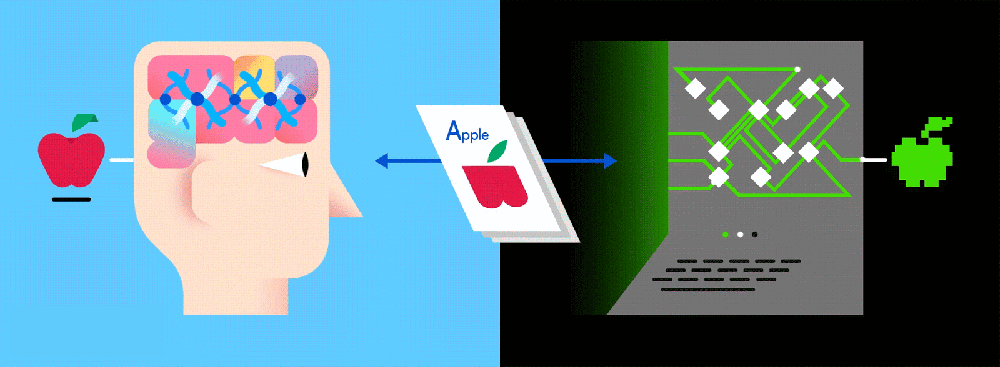

# Deep Learning Basics

> Deep Learning, is just a type of Machine Learning, inspired by the structure of a human brain.

- Deep learning algorithms analyze data with a predetermined logical structure in order to reach similar conclusions as humans.

- Deep learning uses a multi-layered structure of algorithms called neural networks.

- The neural network's architecture is focused on the structure of the human brain.

- Just as we use our brains to recognize patterns and categorize various types of information, neural networks can be trained to do the same with data.

Image source unknown (message for credits)

### You can read about Deep Learning in details on provided links: 

* [What is Deep Learning and How does it work? - on towardsdatascience](https://towardsdatascience.com/what-is-deep-learning-and-how-does-it-work-2ce44bb692ac)

---
### If you like my work, you can contribute to https://www.patreon.com/xscotophilic

### Thank You!
