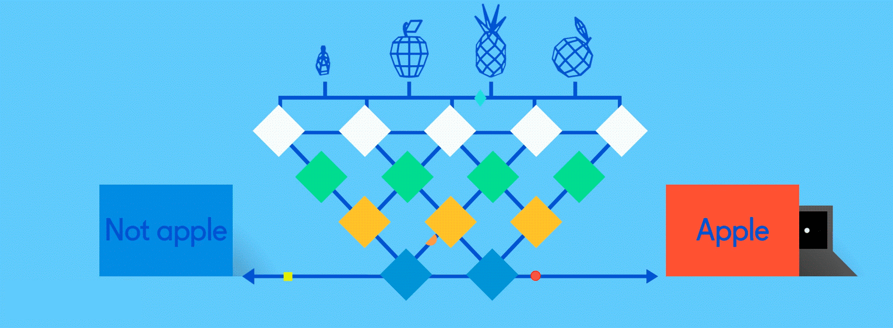
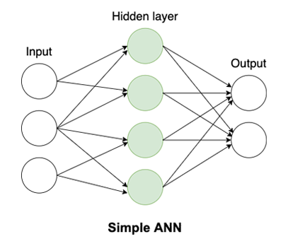
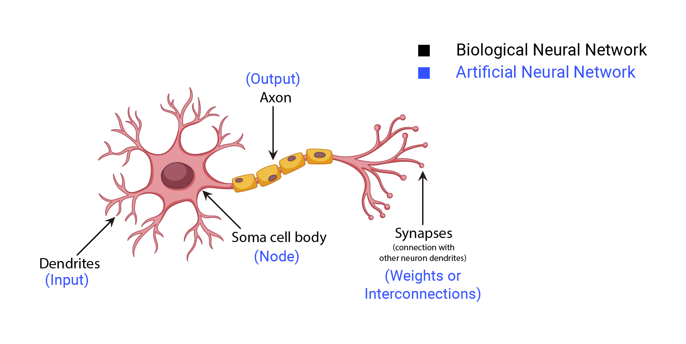
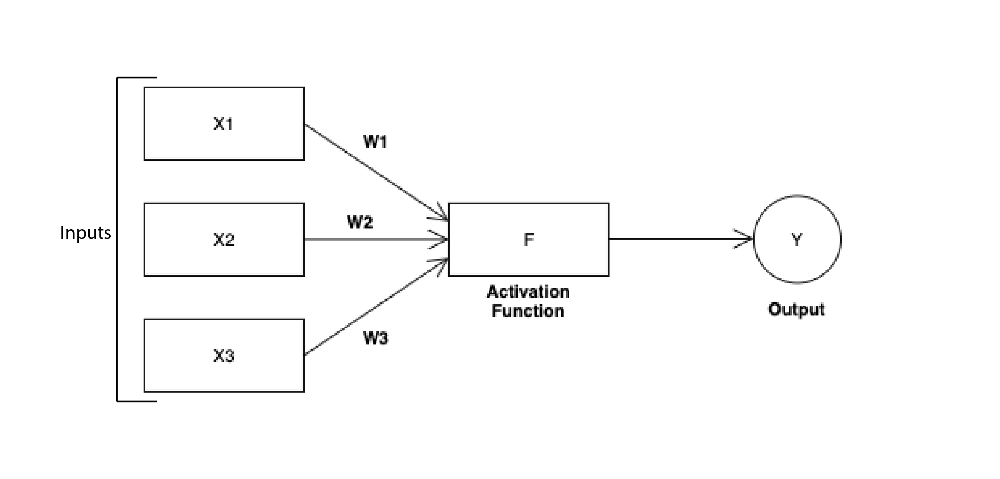
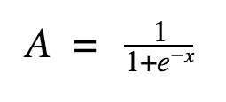
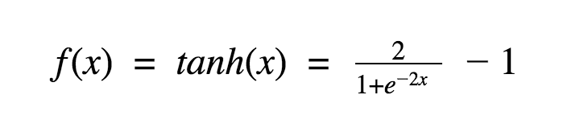
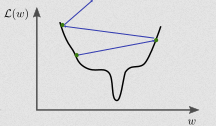
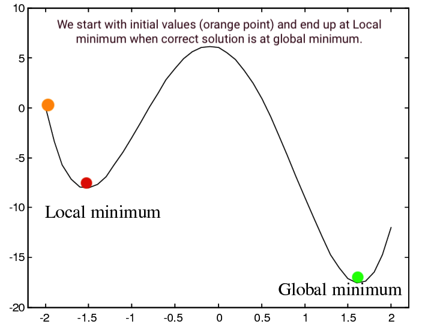

# Artificial Neural Network (ANN)
> The inventor of the first neurocomputer, Dr. Robert Hecht-Nielsen, defines a neural network as "...A computing system made up of a number of simple, highly interconnected processing elements, which process information by their dynamic state response to external inputs.”

Image source unknown (message for credits)

- ANNs are composed of multiple nodes. The nodes are linked together and interact with one another. Each link has a weight associated with it.

- A simple ANN is depicted in the diagram below.

## What will we learn now?
1. The neuron 
2. Activation functions
3. How do neural networks work?
4. How do neural networks learn?
5. Gradient descent
6. Stochastic gradient descent
7. Backpropagation
8. Code for Artificial Neural Network

---

## 1. The neuron

- The neuron is the basic working unit of the brain. Like wise neuron is basic working unit of the ANN (Artificial Neural Network).

- Similarities between Biological Neural Network and Artificial Neural Network.

- Model of Artificial Neural Network

- We give input to the neuron, neuron processes it and gives us out.
- The network of neurons is much more powerful than a single one.
- A network of neurons constitutes a neural network.

---

## 2. Activation functions

- The Activation Functions can be divided into 2 types:
1. Linear Activation Function
2. Non-linear Activation Functions

- It is used to determine the output of a neural network like yes or no.

  ### 1. Step Function:
  - Declare Y activated if the value of X exceeds a certain threshold.

  ### 2. Linear Function:
  - A = cx
  - A straight line function in which the activation is proportional to the input.

  ### 3. Sigmoid Function:
  - It is nonlinear in nature.
  - 
  - Sigmoid functions are one of the most widely used activation functions today.
  - Any small changes in the values of X in that region will cause values of Y to change significantly.

  ### 4. Tanh Function:
  - It has characteristics similar to sigmoid function.
  - 
  - Tanh is also a very popular and widely used activation function.

  ### 5. ReLu Function:
  - A(x) = max(0,x)
  - It gives an output x if x is positive and 0 otherwise.

### How do we know which one to use?
- When you know the characteristics of the function you're attempting to approximate, you can select an activation function that will approximate the function faster, resulting in a faster training process.
- If you don't know the nature of the function you're trying to learn, I'd recommend starting with ReLu and working backwards.

### You can read about Deep Learning in details on provided links: 

* [Understanding Activation Functions in Neural Networks - on medium](https://medium.com/the-theory-of-everything/understanding-activation-functions-in-neural-networks-9491262884e0)
* [Activation Functions in Neural Networks - on towardsdatascience](https://towardsdatascience.com/activation-functions-neural-networks-1cbd9f8d91d6)

---

## 3. How do neural networks work?

- Shold I buy a house?
  - depends on
  1. Location and size
  2. The neighborhood
  3. The age of a property
  4. etc.
  - Where one factor weighs more than another. A decision can be made based on the inputs provided to a neuron. The model can be trained to determine which factors are weighted how heavily.

- Each single neuron can make decisions based on the inputs. And how it makes a decision is given below.
  1. Multiply all of the inputs by their weights w, which indicate how important each input is to the output.
  2. Perform the weighted sum. The weighted sum is the result of adding them all together.
  3. Apply the activation function.

- There are different types of neurons which can be used.
  - Perceptron.
  - Sigmoid neurons.

- It is possible to build more complex networks with more hidden units, where each layer takes the output of the previous one and weights it, and make a more and more complex decisions.

---

## 4. How do neural networks learn?

- 1. How a neural network learns from the provided training sets?
  - Neural networks learn via supervised learning; it involves an input variable x and an output variable y. A training dataset is used to train the algorithm. Algorithms make predictions on the data iteratively with each correct answer.

  2. How ideal weights are calculated?
  - Begin the process by randomly initializing the weights and biases. The weights are then adjusted using various techniques.
  - We will see techniques such as:
    - Gradient descent
    - Stochastic gradient descent
    - Backpropagation

---

## 5. Gradient descent

* A steep mountain with a base that touches the sea may be used as an analogy. We assume that a person's objective is to descend to sea level. To achieve the target, the individual should ideally take one step at a time. The hiker continues down until he hits the bottom or reaches a point where there is no more space to go down.

Image source medium.
- We need an additional term called bias which is added to the weighted sum to train our model. These numerical values (weights, bias) are the ones we'll try to adjust through training phase. Consider These numerical values (weights, bias) as a hiker.

- The gradient is a numerical calculation that informs us how to change the parameters of a network such that the output variance is as small as possible.

  In batch gradient descent: All available data is injected at once.

  What we do normally to find the numerical values (weights, bias) is We calculate the activation for the incoming parameters, then feedforward using the weighted sum of the activation and its bias. We get the output sample's error term by subtracting it from the actual "target" value.

- **But what we do in gradient descent is :**
  - Starting with the final layer, we compute the error vectors backwards. By taking the partial derivative of the function with respect to w, we can determine how much change is necessary, depending on the activation function.
  - The change value gets multiplied by the learning rate. We subtract this value from the previous output to get the updated value as part of the output. We'll keep doing this until we hit convergence.

- We'll repeat the previous process in an attempt to hit the loss function's global minimum, hoping to avoid bouncing around it, sinking into a local minimum, or being trapped in a "saddle point". To avoid these problems we can use **"Stochastic gradient descent"**

sinking into a local minimum instead of finding correct solution.

---

## 6. Stochastic gradient descent

- In Stochastic Gradient Descent, For each iteration, a few samples are chosen at random rather than the entire data set.
  - On the one side, SGD fluctuation allows it to leap to new and potentially better local minima. On the other hand, since SGD will continue to overshoot, convergence to the exact minimum will be hindered.

- It is also common to sample a small number of data points instead of just one point at each step and that is called **“mini-batch”** gradient descent.

---

## 7. Backpropagation

- Understanding how adjusting the weights and biases in a network affects the cost function is what backpropagation is all about. Eventually, computing partial derivatives is needed.
  - The difference between the expected and forward propagated outputs from the network is measured as error. These errors are then propagated backwards across the network, from the output layer to the hidden layer, assigning blame and changing weights along the way.

- You can read about it in details on provided links: 
 [neural networks and deep learning - on neuralnetworksanddeeplearning](http://neuralnetworksanddeeplearning.com/chap2.html)

 ---
 
 ## 8. Code for Artificial Neural Network
 - Look into Python and R section of ANN.

---

### You can read about ANN in details on provided links: 

* [Artificial Neural Network Basic Concepts - on tutorialspoint](https://www.tutorialspoint.com/artificial_neural_network/artificial_neural_network_basic_concepts.htm)
* [Understanding Activation Functions in Neural Networks - on medium](https://medium.com/the-theory-of-everything/understanding-activation-functions-in-neural-networks-9491262884e0)
* [Activation Functions - on geeksforgeeks](https://www.geeksforgeeks.org/activation-functions/#:~:text=The%20activation%20function%20is%20a,are%20used%20in%20Deep%20Learning.)
* [Activation Functions in Neural Networks - on towardsdatascience](https://towardsdatascience.com/activation-functions-neural-networks-1cbd9f8d91d6)
* [Understanding Neural Networks: What, How and Why? - on towardsdatascience](https://towardsdatascience.com/understanding-neural-networks-what-how-and-why-18ec703ebd31)
* [How Neural Networks “Learn” - on towardsdatascience](https://towardsdatascience.com/how-neural-network-learn-3b56c175b5ca)
* [How does a neural network learn? - on towardsdatascience](https://towardsdatascience.com/how-does-a-neural-network-learn-f33bcff61026)
* [Understanding the Mathematics behind Gradient Descent - on towardsdatascience](https://towardsdatascience.com/understanding-the-mathematics-behind-gradient-descent-dde5dc9be06e)
* [Stochastic Gradient Descent Clearly Explained! - on towardsdatascience](https://towardsdatascience.com/stochastic-gradient-descent-clearly-explained-53d239905d31)
* [ML | Stochastic Gradient Descent (SGD) - on geeksforgeeks](https://www.geeksforgeeks.org/ml-stochastic-gradient-descent-sgd/)
* [Back Propagation Neural Network: Explained With Simple Example - on guru99](https://www.guru99.com/backpropogation-neural-network.html)
* [How Does Back-Propagation in Artificial Neural Networks Work? - on towardsdatascience](https://towardsdatascience.com/how-does-back-propagation-in-artificial-neural-networks-work-c7cad873ea7)
* Book - A neural network in 13 lines of python (neural networks and deep learning) by **michael nielsen**
---
### If you like my work, you can contribute to https://www.patreon.com/xscotophilic

### Thank You!
