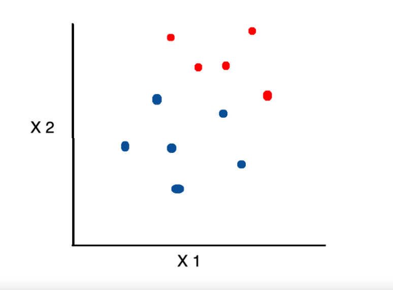
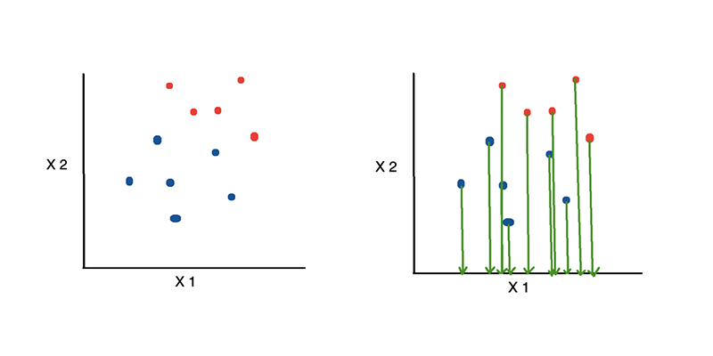
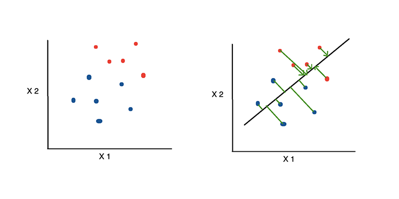

# Linear Discriminant Analysis (LDA)

> Linear discriminant analysis (LDA), also known as normal discriminant analysis (NDA) or discriminant function analysis, is a generalization of Fisher's linear discriminant, a method used in statistics and other fields to find a linear combination of features that characterizes or separates two or more classes of objects or events.

- Assume we plotted a relationship between two variables, with each color representing a different class.

    
Image source unknown (message for credits)
- If we want to reduce the number of dimensions to one, one option is to project everything onto the x-axis.
  
- Image source towardsdatascience
- Linear Discriminant Analysis, on the other hand, uses the information from both features to create a new axis and projects the data onto the new axis.
  
- Image source towardsdatascience
### You can read about Linear Discriminant Analysis (LDA) in details on provided links:

- [Linear Discriminant Analysis, Explained - on towardsdatascience](https://towardsdatascience.com/linear-discriminant-analysis-explained-f88be6c1e00b)
- [Linear Discriminant Analysis In Python - on towardsdatascience](https://towardsdatascience.com/linear-discriminant-analysis-in-python-76b8b17817c2#:~:text=Linear%20Discriminant%20Analysis%20(LDA)%20is,as%20much%20information%20as%20possible.)

---

### If you like my work, you can contribute to https://www.patreon.com/xscotophilic

### Thank You!