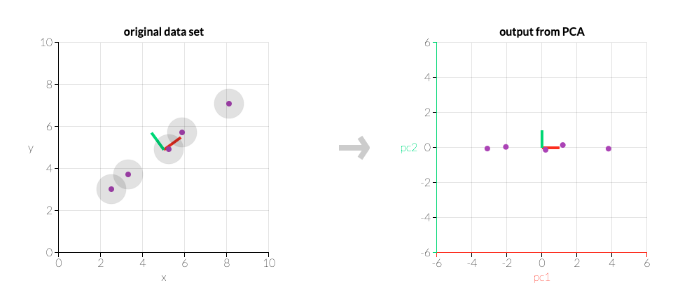

# Principal Component Analysis (PCA)

> Principal component analysis (PCA) is the process of computing the principal components and using them to change the basis of the data, sometimes only using the first few principal components and ignoring the rest.

- When should I use PCA?

  - Do you want to reduce the number of variables but can't figure out which ones to eliminate completely?
  - When you want to make certain that your variables are independent of one another.

- How does PCA work?
  - We'll create a matrix that summarizes how our variables are related to one another.
  - The matrix will then be divided into two parts: direction and magnitude. The screenshot from the setosa.io applet below shows the two main directions in this data: the "red direction" and the "green direction." The “red direction” is more important in this case.
  - 
    
    Image source setosa.io
  - To align with these critical directions, we will transform our original data.
  - All the steps in details are given on: [Link 1](https://towardsdatascience.com/a-one-stop-shop-for-principal-component-analysis-5582fb7e0a9c)

### You can read about Principal Component Analysis (PCA) in details on provided links:

- [A One-Stop Shop for Principal Component Analysis - on towardsdatascience](https://towardsdatascience.com/a-one-stop-shop-for-principal-component-analysis-5582fb7e0a9c)
- [setosa.io](https://setosa.io/ev/principal-component-analysis/)
---

### If you like my work, you can contribute to https://www.patreon.com/xscotophilic

### Thank You!
