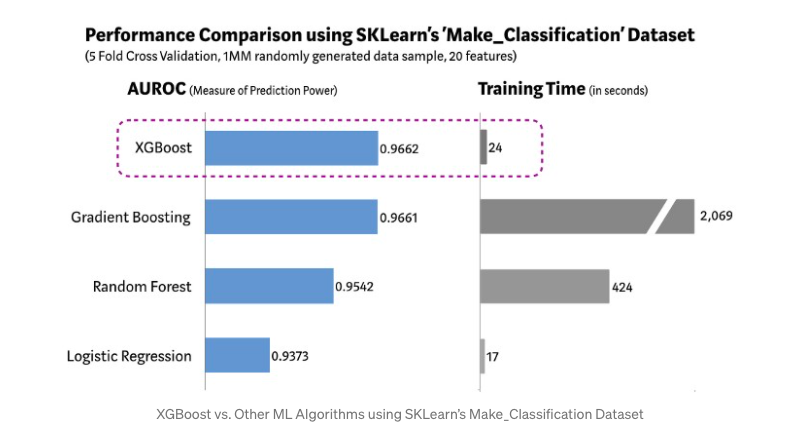

# XGboost

> XGBoost is a decision-tree-based ensemble Machine Learning algorithm that uses a gradient boosting framework.

- The algorithm differentiates itself in the following ways:
  - Supports all major programming languages.
  - A diverse set of applications: Regression, classification, ranking, and user-defined prediction problems can all be solved with it.
  - Cloud Integration: Works well with AWS, Azure, and Yarn clusters, as well as Flink, Spark, and other ecosystems.

- XGBoost is the ideal combination of software and hardware optimization techniques for producing superior results with fewer computing resources in the shortest amount of time.

- XGBoost and Gradient Boosting Machines (GBMs) are ensemble tree methods that use the gradient descent architecture to boost weak learners (CARTs in general). XGBoost, on the other hand, enhances the base GBM framework through system optimization and algorithmic enhancements.

- 
    
Image source towardsdatascience.com

### You can read about XGboost in details on provided links:

- [XGBoost Algorithm: Long May She Reign! - on towardsdatascience](https://towardsdatascience.com/https-medium-com-vishalmorde-xgboost-algorithm-long-she-may-rein-edd9f99be63d)

- [XGBoost GitHub Repo](https://github.com/dmlc/xgboost)

---

### If you like my work, you can contribute to https://www.patreon.com/xscotophilic

### Thank You!
